# G3D-ViT: 3D GradCAM for Vision Transformers

## Overview

G3D-ViT is a **3D GradCAM implementation for Vision Transformers (ViTs)**, designed to visualize important regions in 3D data by leveraging gradient-based activation maps. This method is particularly useful for understanding model decisions in **fMRI-based classification tasks**.

## Origin

This project originated during the development of **[fMRI2Vec](https://github.com/gillet-thomas/fMRI2vec)**. After implementing a 3D Vision Transformer to encode fMRI timepoints (volumes) and classify them, a need emerged for an interpretability method that could highlight **regions of interest (ROIs)** the ViT focused on during classification. G3D-ViT was developed to fill that gap and provide insights into **which brain regions the model "looked at"** when predicting outcomes such as **gender or age** on the fMRI timepoints.

## State of the Art - Class Activation Maps

Since GradCAM and other explainability tools were originally designed for **CNNs**, a **3D ResNet** was trained to match the performance of the 3D ViT. This allowed testing of standard CNN-based interpretability methods on the ResNet, creating a **ground truth class activation map**. This ground truth would be useful to then replicate that map using existing or custom techniques adapted for the 3D ViT.

To evaluate the correctness of the tested approaches, two main criteria were used: the highlighted regions should be within the brain (inside the skull), and for age classification tasks, regions such as the ventricles should be highlighted since ventricular enlargement is a known biomarker that correlates with aging.

### Evaluation of CNN Interpretability Methods

Here are all the CNN interpretability methods* that were evaluated:  

- **pytorch-grad-cam GradCAM**: Not consistent across subjects; highlighted regions often outside the brain.
- **pytorch-grad-cam LayerCAM**: Consistent results, effective for both age and gender.
- **pytorch-grad-cam GradCAMElementWise**: Similar to LayerCAM; consistent and reliable.
- **pytorch-grad-cam HiResCAM, EigenCAM, EigenGradCAM**: Worked well for age prediction, not for gender.
- **pytorch-grad-cam GradCAM++, FullGrad, ScoreCAM, XGradCAM**: Did not work as expected due to reshaping issues.
- **CAPTUM LayerGradCam**: Not consistent across subjects; highlighted regions outside the brain.
- **CAPTUM Integrated Gradients**: Produced random-looking attributions.
- **SHAP (on 3D ResNet50)**: Did not yield interpretable results.

**pytorch-grad-cam GradCAM**, **LayerCAM**, and **GradCAMElementWise** came out as the most accurate methods, with consistent results for both age and gender classification.

\*_methods tested on a trained 3D ResNet achieving 100% accuracy on training and 98% on validation for age and gender classification_

### Evaluation of Vision Transformer (ViT) Interpretability Methods

After generating a reliable ground truth class activation map using a 3D ResNet model, I evaluated several interpretability methods tailored for Vision Transformers. The goal was to assess how well these methods could replicate the attention patterns from the 3D ResNet model. Here is a summary of the tested ViT explainability methods* and their results:  

- **GradCAM** [GitHub](https://jacobgil.github.io/pytorch-gradcam-book/vision_transformers.html)
  - Designed for 2D data by default, and could not adapt it succesfully for 3D.

- **Beyond Attention** [Paper](https://openaccess.thecvf.com/content/CVPR2021/papers/Chefer_Transformer_Interpretability_Beyond_Attention_Visualization_CVPR_2021_paper.pdf) [GitHub](https://github.com/hila-chefer/Transformer-Explainability/tree/main)  
  - Requires using a custom ViT-LRP model provided by the authors.  
  - Model retraining is necessary, and scaling to 3D adds complexity.

- **Partial LRP** [Paper](https://www.google.com/search?client=firefox-b-d&q=Analyzing+multi-head+self-attention%3A+Spe-+cialized+heads+do+the+heavy+lifting%2C+the+rest+can+be+pruned)  
  - Promising approach, but the referenced paper is not specifically focused on Partial LRP.  
  - Typically requires full LRP as a prerequisite, increasing integration overhead.

- **Rollout** [GitHub](https://github.com/jacobgil/vit-explain)  
  - Code is not functional out of the box, there is a problem with the `attentions` parameter in the `rollout` function, even in the official GitHub repository version.

- **LeGrad** [GitHub](https://github.com/WalBouss/LeGrad)  
  - Depends on OpenCLIP and supports only a fixed set of pretrained models.  
  - Incompatible with custom ViT architectures.

- **Transformers-Interpret** [GitHub](https://github.com/cdpierse/transformers-interpret?tab=readme-ov-file)  
  - Built for Hugging Face's transformer models; does not support custom ViTs or 3D data.
  
None of the tested methods for 3D ViT enabled the reproduction of the ground truth activation map generetad on the 3D ResNet, motivating the development of a custom solution.

\*_methods tested on a trained 3D ViT achieving 100% accuracy on training and 90%+ on validation for age and gender classification)_

---

## G3D-ViT Implementation Details
G3D-ViT works on a trained 3D ViT for classification. It registers **hooks** to capture **activations** during the forward pass of the model and **gradients** during the backward pass.

The 3D Vision Transformer model used in this project is a direct implementation of the [3D ViT by lucidrains](https://github.com/lucidrains/vit-pytorch?tab=readme-ov-file#3d-vit), which was used without modification to encode and classify the fMRI volumes.

1. **Hook Registration and Calling**  
Both hooks are registered on the **last normalization layer** of the ViT (`vit3d.transformer.layers[-1][0].norm`).  
This specific layer was chosen because it consistently produced the most interpretable results compared to other layers.  
This finding aligns with recommendations from [jacobgil's guide on GradCAM for Vision Transformers](https://jacobgil.github.io/pytorch-gradcam-book).

- **Forward hook** captures the output of the last normalization layer, revealing *where* the model detected patterns (**activations**). This forward hook is called during the forward pass triggered by the classification of the input sample.
- **Backward hook** captures the gradient of the loss (after backpropgating the logit of the predicted class), revealing the importance (**gradients**) of each parameter for the final prediction of that class. This backward hook is called during the backward pass which is manually triggered in the `get_attention_map` function.

2. **Gradient-Based Weighting Computation**
   - Compute **gradient importance scores** by averaging gradients along the feature dimension.
   - This results in a **single importance score** (**weight**) per spatial location (ViT patch).

3. **Activation Scaling**
   - Weight each path's activatoins by multiplying them with its **weight**.
   - Sum across patch activation dimension to obtain a **single attention score per patch**.

4. **Create final 3D GradCAM**
   - Remove the CLS token to process the patches value only.
   - Reshape patches to 3D grid.
   - Normalize values with relu and scale between 0 and 1.
5. **Thresholding** (optional)
To refine the attention maps, an optional **thresholding** step is included in the `get_attention_map` function. For all tests and by default, only the **top 5% of gradients** are kept to focus on the most important regions.

### Gradients averaging methods (step 2)
For **averaging the weights** along the feature dimension, the following four methods are available:

```python
weights = gradients.mean(dim=2, keepdim=True)  # Global Average Pooling (Default)
weights = gradients.max(dim=2, keepdim=True)[0]  # Max Pooling
weights = gradients.abs().mean(dim=2, keepdim=True)  # Absolute Mean Pooling
weights = F.relu(gradients).mean(dim=2, keepdim=True)  # ReLU Activation Pooling
```

In practice, Global Average Pooling (the default method commonly used in CNN-based GradCAM) was applied for all evaluations. However, one may experiment with the other averaging methods that could produce better results depending on the nature of the dataset being used.

## Usage
The input data consists of **fMRI timepoints (volumes)** which are **reshaped into 90 × 90 × 90 3D volumes** before being processed by the 3D ViT.

1. Prepare fMRI data as 90 × 90 × 90 3D volumes.
2. Train the 3D ViT on a classification task.
3. Compute the GradCAM activation maps using the trained model.
4. Visualize important regions in 3D space.

### Applications

- **Medical imaging**: Understanding brain activity in fMRI-based classification.
- **Neuroscience**: Identifying regions of interest (ROIs) in brain scans.
- **Model interpretability**: Gaining insights into how ViTs process spatial patterns in 3D data.

---

## Validation: Mock Dataset Experiment
To evaluate the accuracy of the implemented 3D GradCAM solution, a **mock dataset was created**. This dataset consists of a 3D cube of arbitrary size containing a smaller "target cube" embedded within it. The objective was to train the 3D Vision Transformer for classification on this synthetic dataset until it reached 100% accuracy on the training set and 90%+ on the validation set. Once the model was fully trained, its weights were used to test the GradCAM implementation where the output was therefore expected to precisely and exclusively activate over the target cube. _The 3D ViT was trained for 20 epochs, with a batch size of 16, a learning rate of 1e-4, 0 dropout, and no weight decay._

The target cube was positioned at multiples of its size within the grid (**_aligned_**). For instance, a cube with a size of 8 could only have x, y, and z coordinates that are multiples of 8 (e.g., 0, 8, 16, ...). Additional tests were performed with the target cubes placed at random positions (**_not_aligned_**). While the 3D ViT took longer to train for the classification of these random positions due to the increased number of possibilities, the GradCAM results remained consistent (see differences in `results/aligned` and `results/not_aligned` folders).

Two classification tasks were designed to assess how well the GradCAM could localize meaningful regions:
- In the first task, the model was trained to classify the **position** of the target cube within the larger volume. The larger cube was filled with zeros, while the target cube is filled with ones. Each class (label) corresponded to a specific spatial location of the target cube, effectively encoding positional information.
- In the second task, the content of the target cube was set to either -1 or 1, and the classification label was 0 or 1 accordingly. This second task removed any spatial context, focusing purely on **content**. The goal of these experiments was to verify that the GradCAM correctly highlighted the target cube in both position-sensitive and content-only scenarios.

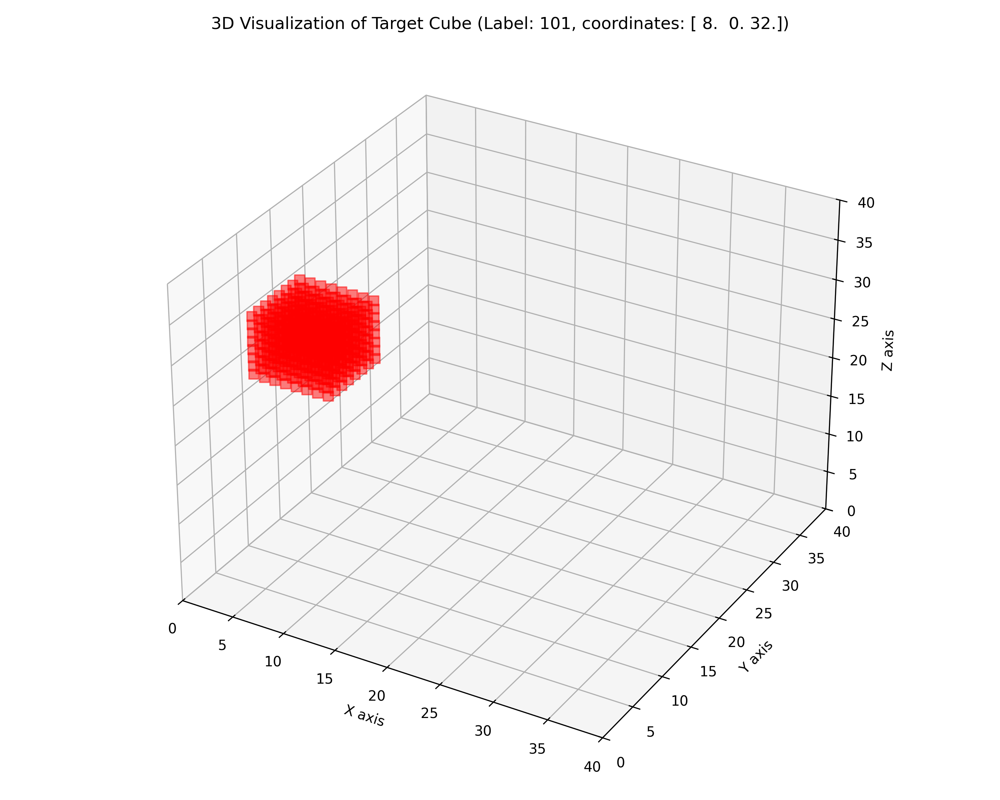
*Mockdataset sample with grid size of 40, target cube of size 8, noise 0. Target cube is aligned and has label 101 on the (40/8)^3 possibilities.*


### Mock Dataset Experiment steps (summary)
1. Train a 3D ViT on this mock dataset.
2. Achieve 100% accuracy on both training and validation.
3. Run G3D-ViT to verify that the attention maps highlight the correct regions.
4. Evaluate interpretability on both:
   - Position-based classification (tests spatial sensitivity).
   - Value-based classification (tests non-spatial sensitivity).

### Results and Observations

The 3D ViT successfully achieved 100% classification accuracy (90%+ on validation dataset) on the mock dataset. Tests revealed that a smaller ViT configuration tended to yield better interpretability results probably because of the shorter gradient path facilitating stronger signal flow. However, for consistency and fidelity with prior work, the **default configuration from lucidrains' 3D ViT was retained**: an embedding dimension of 1024, MLP dimension of 2048, 8 attention heads, and 6 transformer blocks.

<table align="center" style="border-collapse: collapse;">
  <tr>
    <td style="border: 1px solid #ccc; padding: 5px; text-align: center;">
      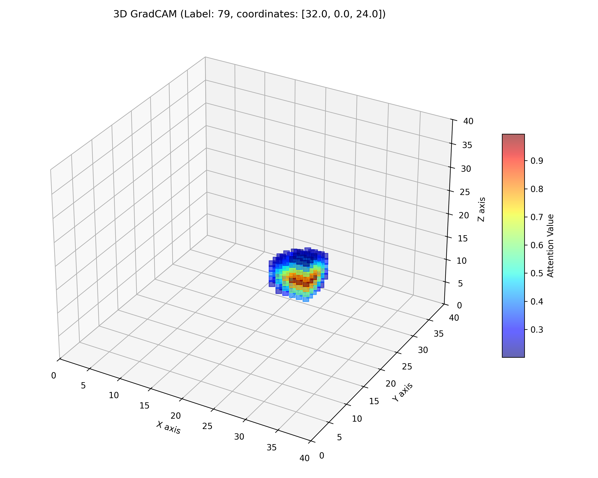
    </td>
    <td style="border: 1px solid #ccc; padding: 5px; text-align: center;">
      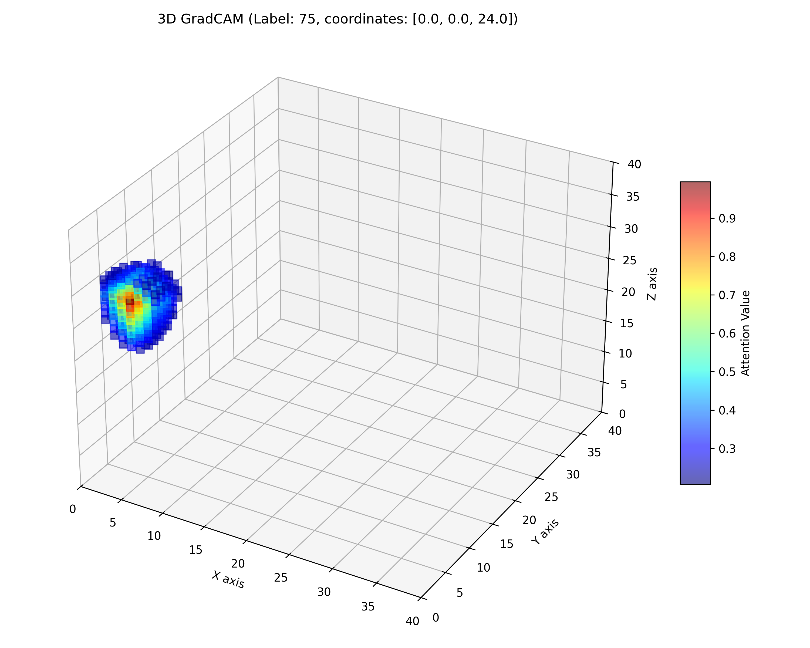
    </td>
  </tr>
</table>

_3D visualization of the class activation map (attention) generated by G3DViT._

Multiple dataset configurations were created, varying the overall cube size (**grid size**), the size of the **target cube**, and the ViT **patch size**. Additionally, a **noise** parameter was introduced to change the background values (everywhere except in the target cube), allowing to analyse how the attention responds in more heterogeneous or noisy environments.

For both classification tasks (in the aligned cube setup), it was observed that setting the ViT patch size equal to (or a divisor of) the target cube size consistently failed. A likely reason is that Vision Transformers perform best when patches contain complex textures, edges, or varying patterns—features that help the model learn meaningful embeddings. When the patch size matches the target cube, patches become overly homogeneous (e.g., all background or all target), making it difficult for the model to distinguish between them. In contrast, when patch sizes are larger than the target or misaligned with it (i.e., the patch partially overlaps the target boundary), the resulting input has richer, more meaningful spatial variations leading to more a reliable localization of the attention.

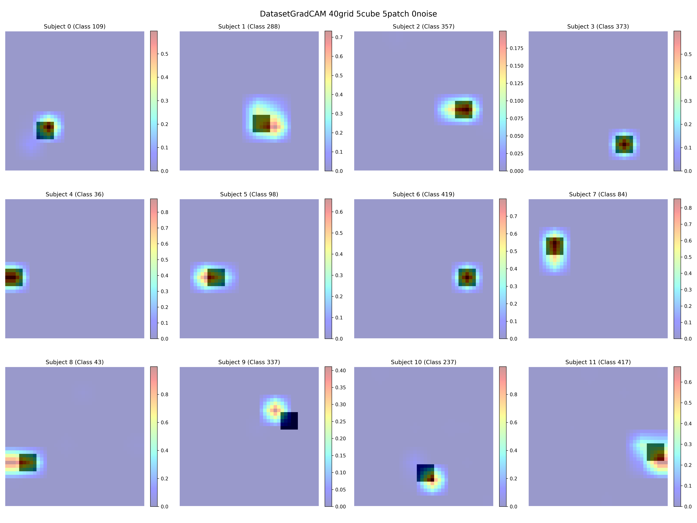
*GradCAM results with a grid size of 40, 0 noise, and a patch size equal to the target cube size (8). The cubes are not aligned in this setup.*

Tests were also conducted by changing the **value of the target cube** from 1 to other values, and no difference was observed in the results of the gradcam.

Another finding was that GradCAM performs better when the **patches are smaller** than the target cube. This makes sense, as having a patch larger than the regions being captured leads to less precise localization, making it harder for the model to focus on the specific areas of interest.

<table align="center" style="border-collapse: collapse;">
  <tr>
    <td style="border: 1px solid #ccc; padding: 5px; text-align: center;">
      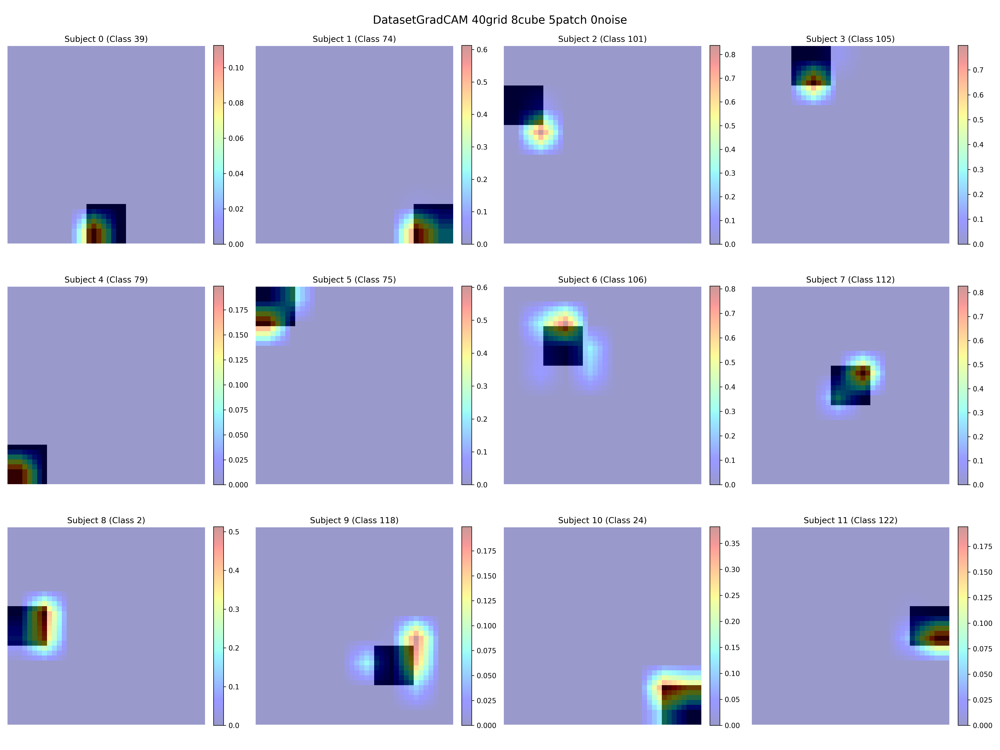
    </td>
    <td style="border: 1px solid #ccc; padding: 5px; text-align: center;">
      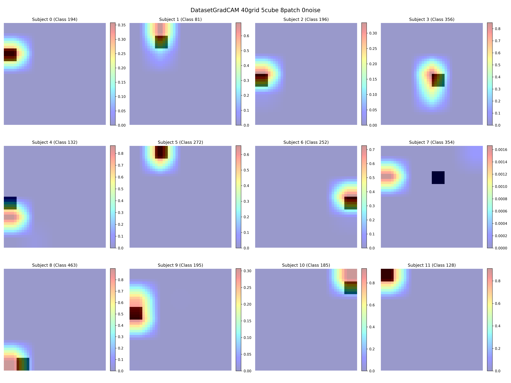
    </td>
  </tr>
</table>

_Side-by-side comparison of GradCAM results with a patch size of 8 and a target cube size of 5 (left), versus a patch size of 5 and a target cube size of 8 (right), using the same grid size, aligned cubes, and no background noise._

The addition of **background noise** did not affect the results, as the GradCAM consistently maintained the same level of precision in highlighting the target region.

<table align="center" style="border-collapse: collapse;">
  <tr>
    <td style="border: 1px solid #ccc; padding: 5px; text-align: center;">
      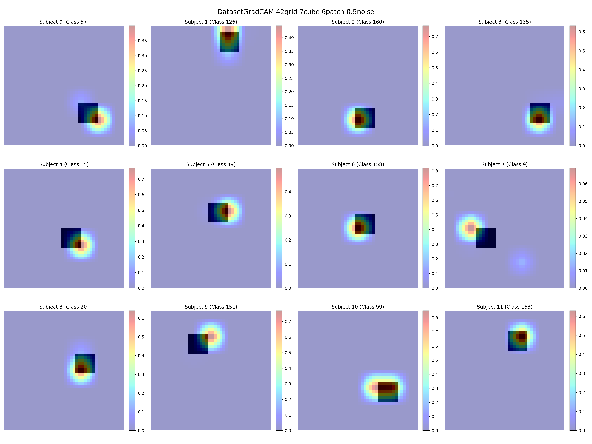
    </td>
    <td style="border: 1px solid #ccc; padding: 5px; text-align: center;">
      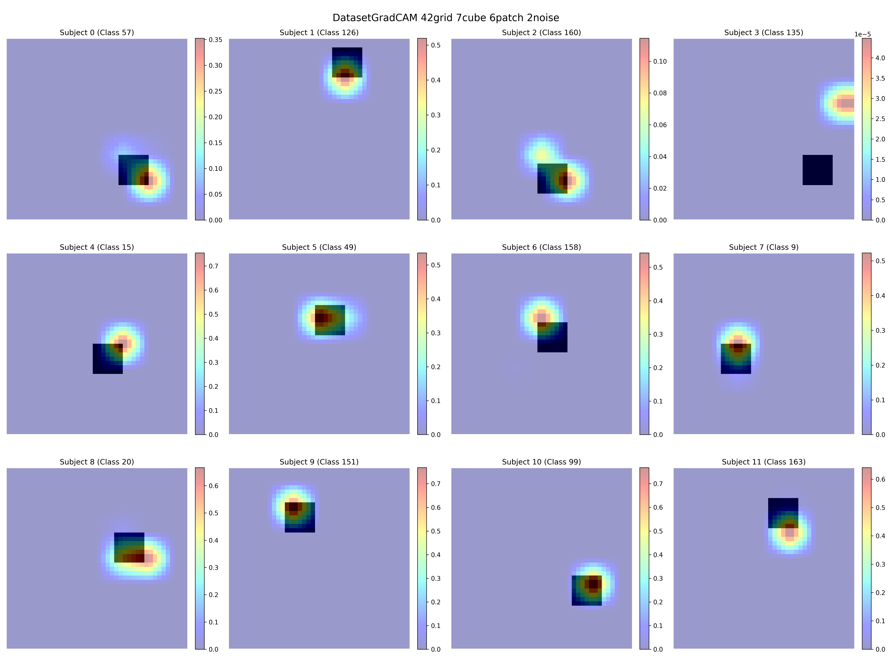
    </td>
  </tr>
</table>

_Side-by-side comparison of GradCAM results with a patch size of 7 and a target cube size of 6, using the same grid size and aligned cubes. Background noise level is 0.5 (left) and 2.0 (right)._

In the **second classification task (value-based)**, the GradCAM also performed strongly demonstrating the produced attention maps can effectively highlight relevant regions in both position-based and value-based classification scenarios.

<table align="center" style="border-collapse: collapse;">
  <tr>
    <td style="border: 1px solid #ccc; padding: 5px; text-align: center;">
      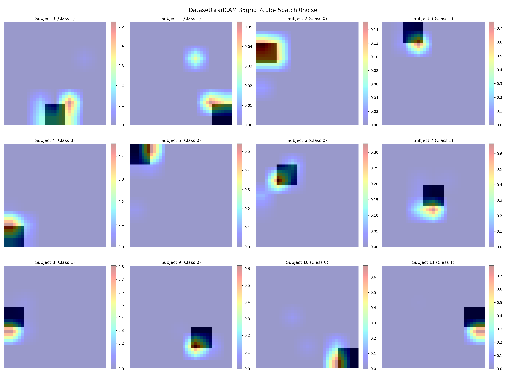
    </td>
    <td style="border: 1px solid #ccc; padding: 5px; text-align: center;">
      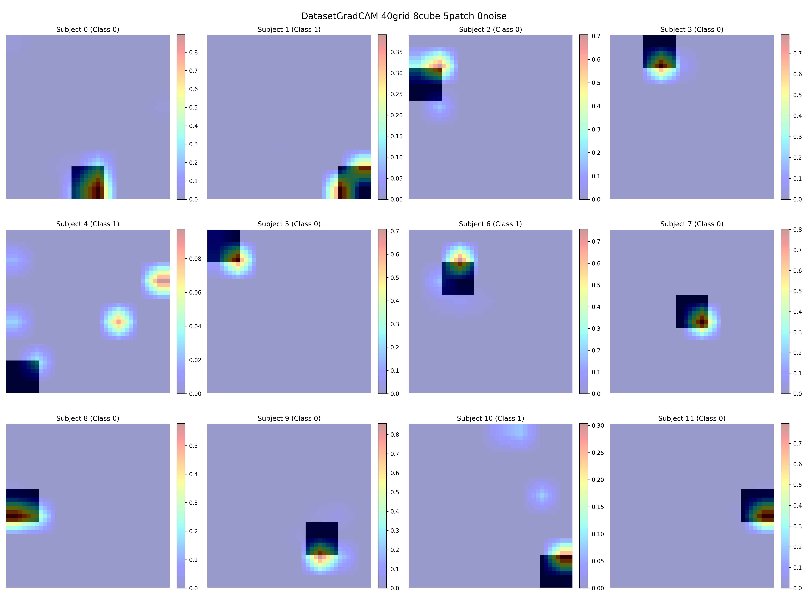
    </td>
  </tr>
</table>

_Side-by-side comparison of GradCAM results for value-based classification using aligned cubes. Left: patch size 5, target cube size 7, grid size 35. Right: patch size 5, target cube size 8, grid size 40. No background noise was added in either case._

## Results on real-world data 
After validation on the mock dataset, G3D-ViT was applied to **real-world fMRI data** (specifically resting-state fMRI samples). The classifier used was the same 3D Vision Transformer trained to perform age group classification (young vs. old participants).

The ViT achieved 100% training accuracy, confirming its ability to separate the two age groups based on the input volumes. G3D-ViT was then used to generate attention maps, with the goal of identifying which brain regions the model relied on for this classification. These attention visualizations offer insights into model behavior and may help interpret age-related brain changes in resting-state fMRI.

<table align="center" style="border-collapse: collapse;">
  <tr>
    <td style="border: 1px solid #ccc; padding: 5px; text-align: center;">
      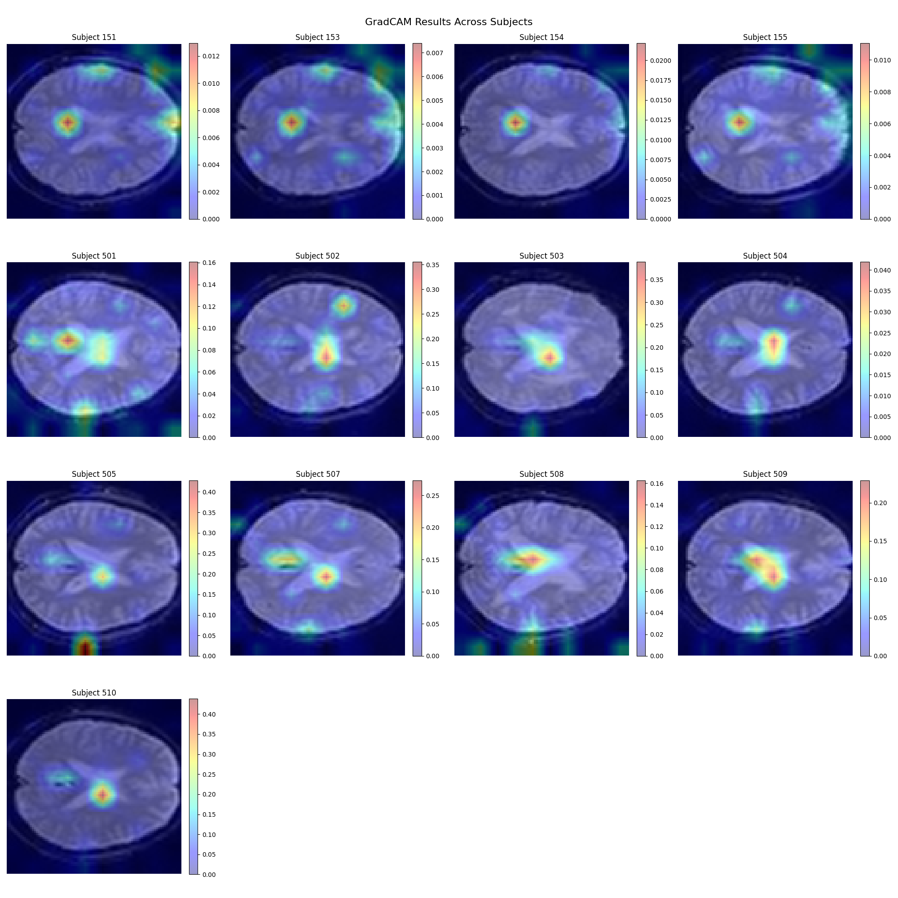
    </td>
    <td style="border: 1px solid #ccc; padding: 5px; text-align: center;">
      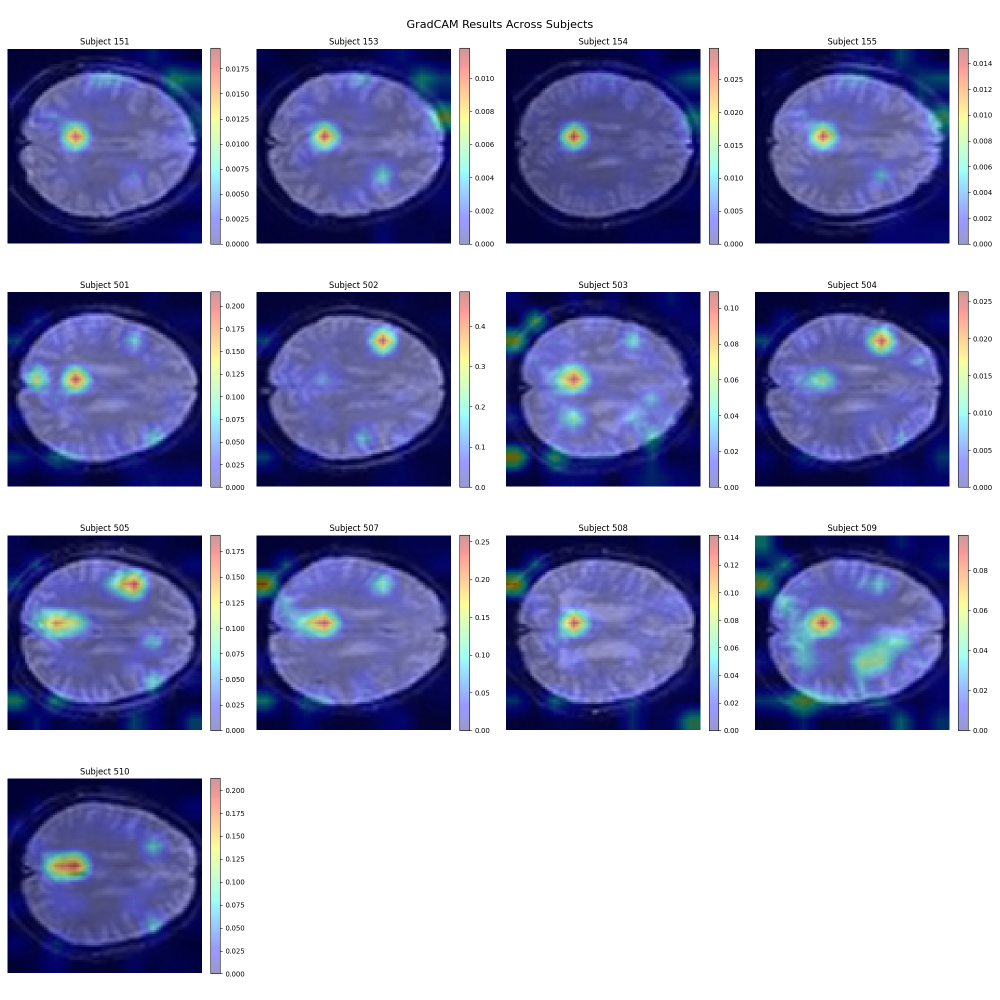
    </td>
  </tr>
</table>

---

## Conclusion
G3D-ViT successfully extends traditional GradCAM to 3D data and Vision Transformers. It bridges the gap left by existing tools that either lack 3D support or are incompatible with ViT architectures.

The method was validated on a controlled mock dataset, demonstrating robust and consistent attention localization under various configurations. The best results were obtained using:
- Mean Average Pooling for gradient weighting
- Thresholding set to 5% of the top gradients
- Both aligned and not_aligned positioned target cubes
- Patch sizes smaller than the region of interest

These findings confirm that G3D-ViT provides meaningful and interpretable visualizations even in complex 3D scenarios.

### Limitations
While promising on synthetic data, further evaluation is required on real fMRI datasets to fully assess performance and generalizability in clinical or research settings.


